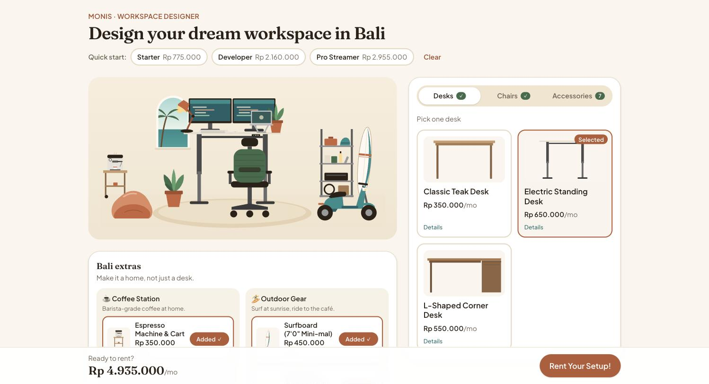

# Monis · Workspace Designer

Design a remote-work setup for your stay in Bali, see it come together live, and rent it by the month.

**Live:** https://monis-workspace-designer-sigma.vercel.app



## Features

- **Configurator:** pick a desk and a chair, then add accessories with quantity limits. Some limits depend on the desk; for example, the standing desk fits two monitors.
- **Live preview:** every item appears on a Bali-style stage and animates in place when swapped. Click an item to swap or remove it. Hotspots such as "+ Add Monitor!" jump to the matching product card.
- **Bali extras:** a coffee station, surfboard, scooter, bean bag and tool shelf, grouped into four zones. The stage widens to make room for them around the platform.
- **Quick-start presets:** Starter, Developer and Pro Streamer, each with its monthly price. Applying a preset or clearing the setup can be undone.
- **Rent your setup:** a summary with edit and remove, a rental length of 1, 3, 6 or 12 months, a delivery form with inline validation, and a confirmation screen. There is no real payment.
- **Persistence:** the setup is saved in `localStorage`, and a setup can be opened from a link (`?desk=…&chair=…&items=monitor.2~plant.1`).
- **Responsive and accessible:** works down to 375px, the whole flow works with the keyboard, screen-reader labels and live regions are in place, colours meet WCAG AA contrast, and animations respect `prefers-reduced-motion`.

## Tech choices

|                                        |                                                                                                                                               |
| -------------------------------------- | --------------------------------------------------------------------------------------------------------------------------------------------- |
| **Next.js 16 (App Router) + React 19** | Every page is static, so it deploys to Vercel without a server.                                                                               |
| **TypeScript**                         | The product catalogue, slots and setup are typed end to end.                                                                                  |
| **Tailwind CSS 4**                     | Design tokens live in `globals.css`, and container queries let the product grids adapt to their panel instead of the viewport.                |
| **Zustand**                            | A small store with `persist` for the setup, plus a separate store for UI state that isn't saved, such as the active tab and reveal/highlight. |
| **Motion**                             | Enter, exit and swap animations in the preview, and the price count-up.                                                                       |
| **Vitest**                             | Unit tests for setup rules, share links, checkout validation and the preview layout engine.                                                   |

All product artwork consists of hand-made transparent SVGs in `public/items/`. Their viewBox is in centimetres, so the items layer at real-world scale.

## Approach

1. **Data first.** Products carry their price, details and preview metadata: slot, z-order, max quantity and size in cm. Desks declare how many items of each slot fit on them.
2. **Pure logic, thin UI.** All rules live in plain functions in `src/lib/setup.ts`: limits, clamping, sanitizing untrusted input from `localStorage` or a URL, totals and share links. The store and components only call them.
3. **Layout engine.** `src/components/preview/layout.ts` turns a setup into positioned items and hotspots in stage coordinates. It has no React in it, so it's unit tested on its own. Components only convert centimetres to percentages.
4. **Small vertical slices.** Each GitHub issue is one shippable step: catalogue, store, configurator, preview, checkout, polish, extras.

```
src/
  app/            pages: designer (/) and checkout (/checkout)
  components/     configurator, preview, checkout, shared UI
  data/           products, presets, zones, delivery areas
  lib/            pure logic (setup rules, checkout validation, formatting)
  store/          Zustand stores (setup, UI, toasts)
```

## Running locally

```bash
npm install
npm run dev     # http://localhost:3000
npm test        # unit tests
npm run lint
npm run build
```

## What I'd improve with more time

- **Backend:** real stock and availability per delivery area, saved orders, and payment through Xendit or Midtrans for IDR.
- **Share button:** links can already be opened, but there is no button yet that copies one.
- **Preview interaction:** drag to rearrange items, and a sticky preview on desktop that doesn't clash with the extras section.
- **End-to-end and visual tests:** Playwright for the full flow and screenshot diffs for the preview at a few breakpoints.
- **Bahasa Indonesia** alongside English.
- **Real product photos,** or 3D renders, alongside the illustrations.
