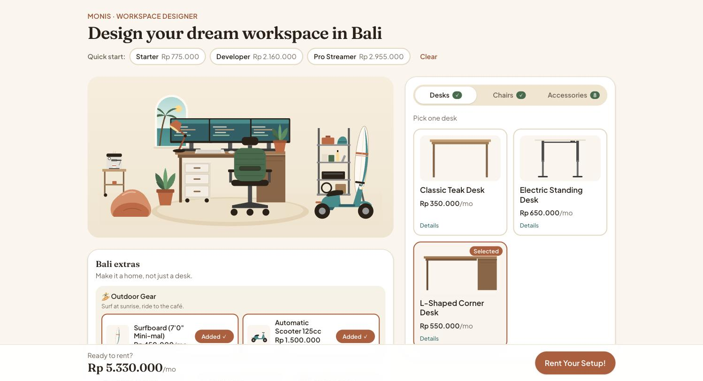
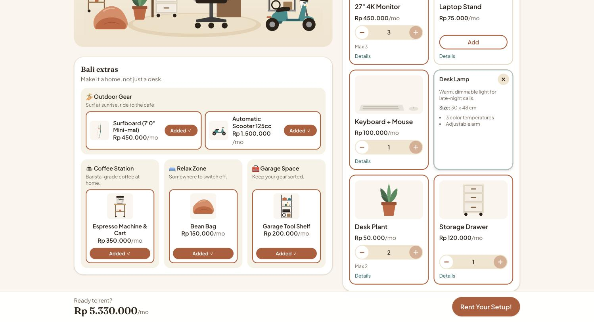
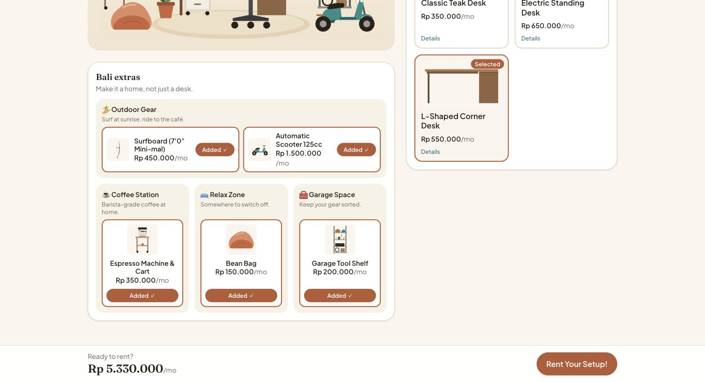
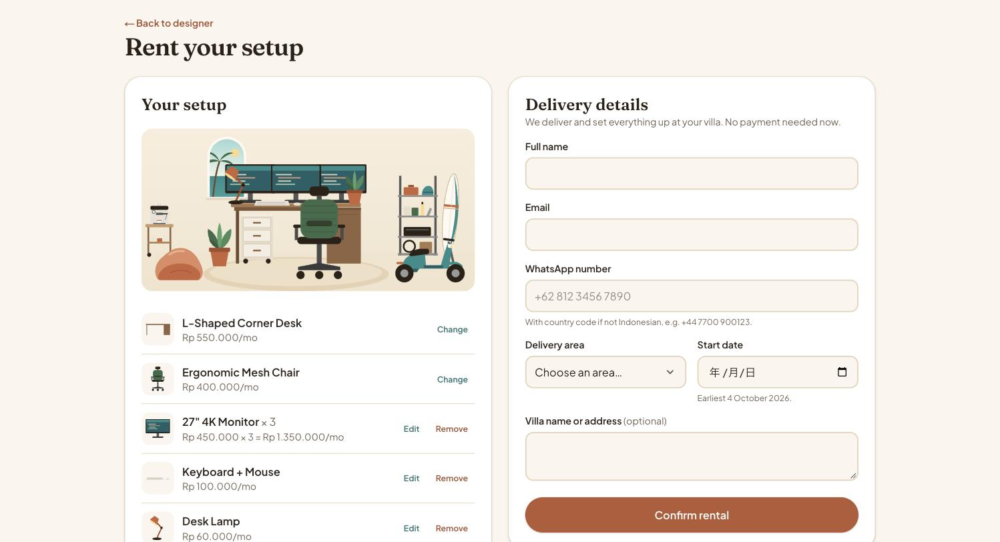
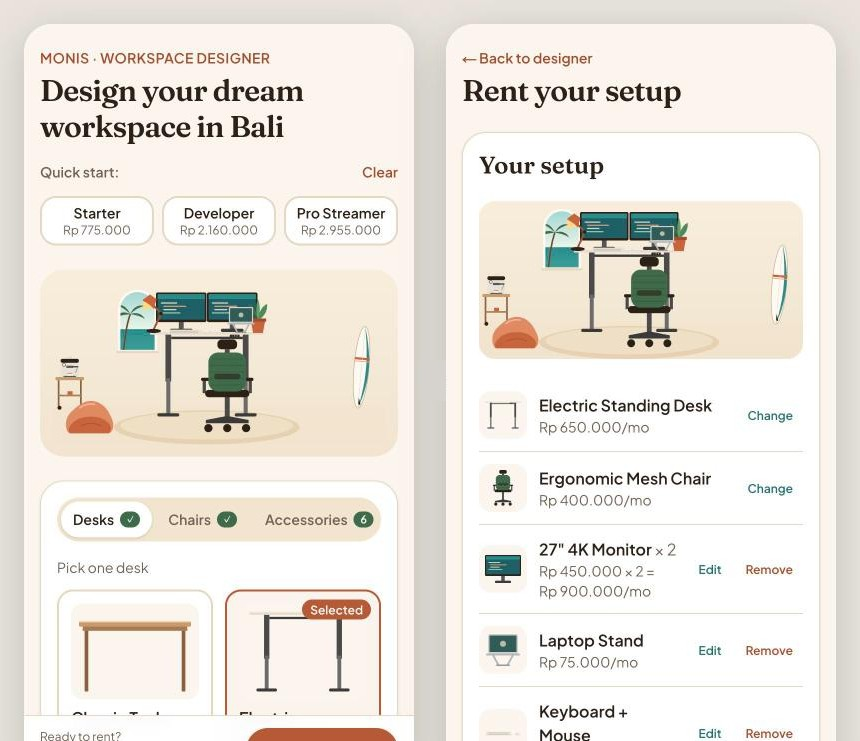

# Monis · Workspace Designer

Design a remote-work setup for your stay in Bali, watch it come together live, and rent it by the month.

**Live demo:** https://monis-workspace-designer-sigma.vercel.app



### Try it in one click

These links open the designer with a ready-made setup. The setup comes from the URL and is then saved in your browser.

- [Full Bali setup](https://monis-workspace-designer-sigma.vercel.app/?desk=desk-l-shaped&chair=chair-ergonomic&items=monitor.3~keyboard-mouse.1~desk-lamp.1~plant.2~storage-drawer.1~coffee-machine.1~bean-bag.1~surfboard.1~scooter.1~tool-shelf.1&months=6): L-shaped desk, three monitors and all five extras
- [Laptop nomad](https://monis-workspace-designer-sigma.vercel.app/?desk=desk-standard&chair=chair-basic&items=laptop-stand.1~keyboard-mouse.1~plant.1~coffee-machine.1&months=3): small and cheap, with an espresso machine
- [Empty start](https://monis-workspace-designer-sigma.vercel.app/): begin from scratch, or pick a quick-start preset

## Screenshots

|                                                                                                   |                                                                                           |
| ------------------------------------------------------------------------------------------------- | ----------------------------------------------------------------------------------------- |
|  |  |
| **Accessories:** quantity limits, with details in a panel over the card                           | **Bali extras:** four lifestyle zones that stand around the platform                      |
|                            |                                       |
| **Checkout:** summary, rental length and delivery details                                         | **Mobile:** the whole flow works on a phone                                               |

## Features

**Design**

- **Desks and chairs:** 3 desks and 3 chairs, each with its price, size and highlights.
- **Accessories:** monitors, laptop stand, keyboard and mouse, lamp, plants and a drawer, with quantity steppers. Limits follow the desk: the standing desk fits 2 monitors, the L-shaped desk fits 3.
- **Bali extras:** espresso machine, surfboard, scooter, bean bag and tool shelf, grouped into the Coffee, Outdoor, Relax and Garage zones.
- **Quick-start presets:** Starter, Developer and Pro Streamer fill a whole setup in one tap, each showing its monthly price.

**Live preview**

- **Real scale:** every item appears on a Bali-style stage with an arched sea-view window and a platform. Items are drawn in centimetres, so a 3-monitor setup really is wider than a laptop.
- **Animations:** swapping a desk or chair cross-fades in place, and items drop in when added and fade out when removed.
- **Wider stage for extras:** the stage widens on the side that has extras, so they stand around the platform instead of on top of the desk.
- **Click to edit:** click any item to swap or remove it. Hotspots such as **+ Add Monitor!**, **+ Place a Plant!** and **+ Pick a Chair** jump to the matching product card and highlight it.
- **Empty state:** a dashed ghost desk on the platform, with a "Step 1" card that leads to the desks.

**Rent**

- **Rent bar:** a sticky "Ready to rent?" bar shows the live monthly total, or tells you what's still missing.
- **Checkout:** a summary with a thumbnail of your setup, where desk and chair can be changed and accessories edited or removed. Rental length is 1, 3, 6 or 12 months, with totals.
- **Delivery form:** name, email, WhatsApp, Bali area, start date and villa, with inline validation. A confirmation screen shows the order recap.

**Feel**

- **Undo:** applying a preset, clearing, removing an item, or a desk swap that drops monitors shows a toast with **Undo**.
- **Skeletons:** a shimmer while the saved setup loads and while product images load, and a short one before a details panel shows its content.
- **Cursor:** on desktop, a terracotta hand-with-sparkle cursor on everything clickable.
- **Price count-up:** the total counts up to its new value. Screen readers get the final number.

**Under the hood**

- **No backend:** the app is static. There is no API, and the setup is saved in `localStorage`. The checkout is a mock: nothing is sent and no payment is taken.
- **Share links:** a setup can be opened from a link (`?desk=…&chair=…&items=monitor.2~plant.1&months=3`). Every value is sanitized before use.
- **Responsive:** works from 375px up, and the product grids use container queries to fit their panel.
- **Accessible:**
  - The whole flow works with the keyboard: tabs use arrow keys, and Escape closes menus and panels.
  - Labels and live regions for screen readers.
  - WCAG AA colour contrast.
  - Respects `prefers-reduced-motion`.

## Tech choices

|                                        |                                                                                                                                               |
| -------------------------------------- | --------------------------------------------------------------------------------------------------------------------------------------------- |
| **Next.js 16 (App Router) + React 19** | Every page is static, so it deploys to Vercel without a server.                                                                               |
| **Tailwind CSS 4**                     | Design tokens in `globals.css`, plus container queries and subgrid for layouts that adapt to their panel instead of the viewport.             |
| **TypeScript**                         | The product catalogue, preview slots and setup are typed end to end.                                                                          |
| **Zustand**                            | A small store with `persist` for the setup, plus a separate store for UI state that isn't saved, such as the active tab and reveal/highlight. |
| **Motion**                             | Enter, exit and swap animations in the preview, and the price count-up.                                                                       |
| **Vitest**                             | 35 unit tests for setup rules, share links, checkout validation and the preview layout engine.                                                |
| **Vercel**                             | Deploys on every push to `main`.                                                                                                              |

All product artwork consists of hand-made transparent SVGs in `public/items/`. Their viewBox is in centimetres, so the items layer at real-world scale.

## Approach

I started from the user: a freelancer who just landed in Bali and wants a working desk by next week. They should _see_ their office, not scroll through a catalogue, so the preview is the hero and every control changes it right away.

1. **Data first.** Each product carries its price, details and preview metadata: slot, z-order, max quantity and size in cm. Desks declare how many items of each slot fit on them.
2. **Pure logic, thin UI.** All rules live in plain functions in `src/lib/setup.ts`: limits, clamping, sanitizing untrusted input from `localStorage` or a URL, totals and share links. The store and components only call them.
3. **Layout engine.** `src/components/preview/layout.ts` turns a setup into positioned items and hotspots in stage coordinates. It has no React in it, so it's unit tested on its own. Components only convert centimetres to percentages.
4. **Small vertical slices.** Each GitHub issue is one shippable step: catalogue, store, configurator, preview, checkout, polish, extras. I checked each one in the browser on desktop and mobile before moving on.

```
src/
  app/            pages: designer (/) and checkout (/checkout)
  components/     configurator, preview, checkout, shared UI
  data/           products, presets, zones, delivery areas
  lib/            pure logic (setup rules, checkout validation, formatting)
  store/          Zustand stores (setup, UI, toasts)
```

## Running locally

```bash
npm install
npm run dev     # http://localhost:3000
npm test        # unit tests
npm run lint
npm run build
```

## What I'd improve with more time

- **Backend:** real stock and availability per delivery area, saved orders, and payment through Xendit or Midtrans for IDR.
- **Share button:** links can already be opened, but there is no button yet that copies one.
- **Preview interaction:** drag to rearrange items, and a sticky preview on desktop that doesn't clash with the extras section.
- **End-to-end and visual tests:** Playwright for the full flow and screenshot diffs for the preview at a few breakpoints.
- **Bahasa Indonesia** alongside English.
- **Real product photos,** or 3D renders, alongside the illustrations.
